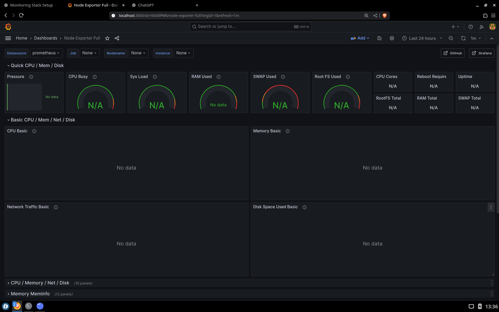
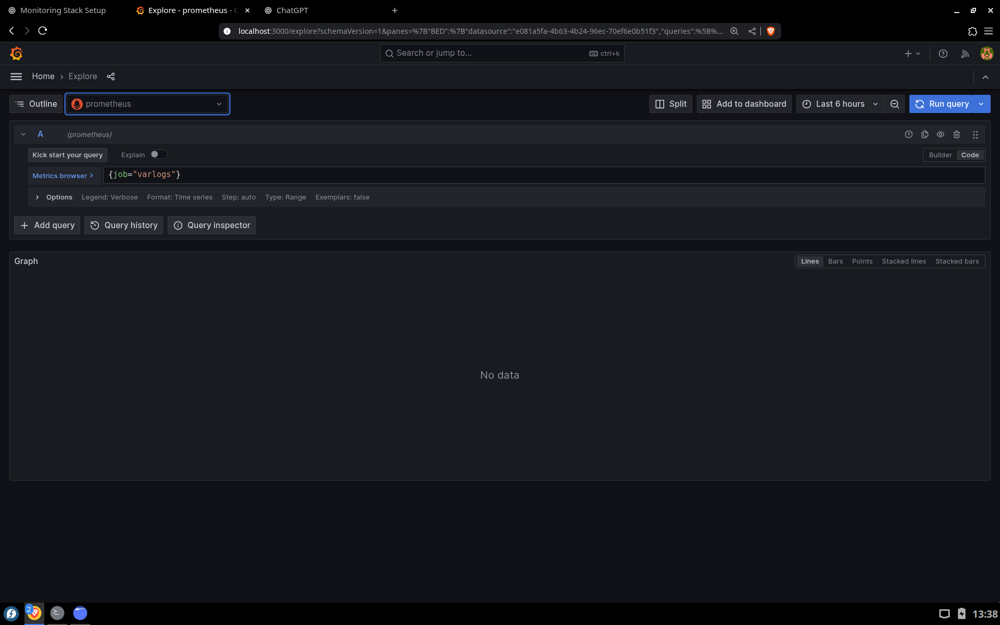
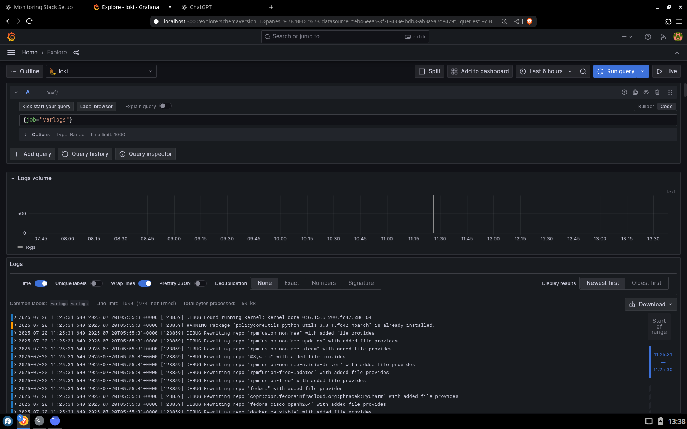

# 🔭 Linux Monitoring Stack

A fully open-source monitoring and observability stack built on Fedora Linux using:

- 📊 **Prometheus** — system & service metrics collection
- 📈 **Grafana** — beautiful dashboards for real-time insights
- 📚 **Loki** — log aggregation and querying
- 📨 **Promtail** — logs collection and shipping to Loki
- 🖥️ **Node Exporter** — exposes system-level hardware + OS metrics

> ✅ Lightweight, fast, modular — perfect for self-hosted DevOps use or college projects.

---

## 📦 Tech Stack:

| Tool           | Purpose                        | Port        |
|----------------|--------------------------------|-------------|
| Prometheus     | Metrics scraper & TSDB         | `9090`      |
| Grafana        | Visual dashboards + alerting   | `3000`      |
| Loki           | Log aggregation                | `3100`      |
| Promtail       | Log forwarder for Loki         | —           |
| Node Exporter  | Linux system metrics           | `9100`      |

---

## 📸 Screenshots:

---

---

